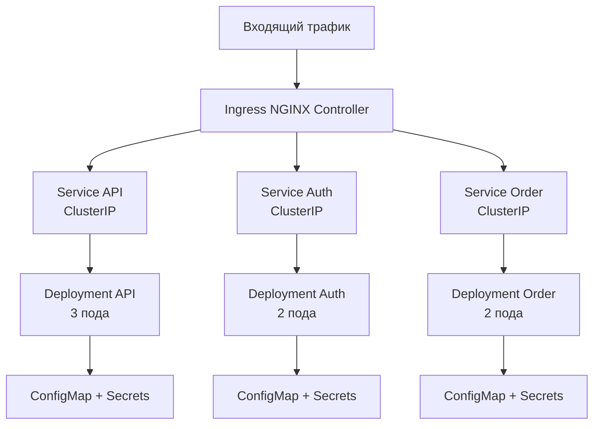
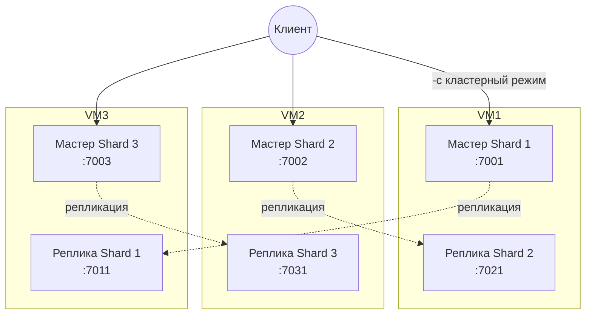

# Решение: Микросервисы — масштабирование

## Задача 1: Кластеризация (Kubernetes)

### Почему Kubernetes

Kubernetes — де-факто стандарт для оркестрации контейнеров. Практически любая серьёзная компания, работающая с микросервисами, использует его или его аналоги. Поддерживает любой облако: AWS (EKS), GCP (GKE), Azure (AKS) или собственный сервер. Экосистема огромная — Helm для пакетов, Istio для сервис-меша, ArgoCD для GitOps.

### Соответствие требованиям

| Требование | Как закрывается в Kubernetes |
|-----------|------------------------|
| Поддержка контейнеров | Под — минимальная единица развёртывания. Поддерживаются Docker, containerd, CRI-O |
| Обнаружение сервисов и маршрутизация | Сервисы (ClusterIP, NodePort, LoadBalancer) + контроллер Ingress + CoreDNS |
| Горизонтальное масштабирование | `kubectl scale --replicas=N` + развёртывание (Deployment) |
| Автоматическое масштабирование | HPA (HorizontalPodAutoscaler) — реагирует на загрузку CPU/RAM или пользовательские метрики |
| Разделение ресурсов (внешние/внутренние) | Ingress для входящего трафика извне + ClusterIP для внутренней связи; сетевые политики (NetworkPolicy) |
| Конфигурация через переменные окружения + секреты | ConfigMap для обычных переменных + Secrets для паролей и ключей; подключение через envFrom |

### Архитектура кластера



### Примеры манифестов

Все файлы лежат в [src_1/](src_1/):

- [deployment.yaml](src_1/deployment.yaml) — развёртывание с лимитами ресурсов и подключением конфигурации через `envFrom`
- [service.yaml](src_1/service.yaml) — внутренний кластерный сервис (ClusterIP)
- [configmap.yaml](src_1/configmap.yaml) — переменные окружения для приложения
- [secrets.yaml](src_1/secrets.yaml) — секретные данные (ключи API, JWT)
- [hpa.yaml](src_1/hpa.yaml) — автоскейлер: от 2 до 10 подов, при загрузке CPU > 70%
- [ingress.yaml](src_1/ingress.yaml) — входящий трафик на `localhost` без TLS

### Как проверить

Запустим скрипт проверки:

```bash
bash scripts/verify-task1.sh
```

Или пошагово:

```bash
kubectl apply -f src_1/
kubectl get pods -o wide
kubectl get svc
kubectl get ingress
kubectl top pods
kubectl get hpa
kubectl logs -l app=security --tail=20
```

---

## Задача 2: Распределённый кеш (Redis Cluster)

### Зачем нужен распределённый кеш

Когда приложение растёт, одного сервера Redis уже не хватает. Redis Cluster решает эту задачу — данные автоматически распределяются по шардам, а при падении одного мастера его место занимает реплика.

### Архитектура кластера

3 шарда, каждый на отдельной VM. В каждой VM свой мастер и реплика другого шарда — если одна VM упадёт, данные не потеряются.



### Конфигурация кластера

Вся конфигурация лежит в [src_2/](src_2/):

- [docker-compose.yaml](src_2/docker-compose.yaml) — 6 нод Redis. YAML-якорь `x-redis-common` задаёт общие параметры.

### Создание кластера

Скрипт создания:

```bash
bash scripts/create-cluster.sh
```

Скрипт проверки:

```bash
bash scripts/verify-task2.sh
```

Или пошагово — запускаем все ноды и создаём кластер. Создание запускается изнутри контейнера, потому что ноды общаются по внутренним IP Docker-сети:

```bash
cd src_2 && docker compose up -d

# Узнаём IP нод
docker inspect src_2-shard1-master-1 --format '{{range .NetworkSettings.Networks}}{{.IPAddress}}{{end}}'
# ... аналогично для остальных

# Создаём кластер (запускаем изнутри контейнера)
docker exec src_2-shard1-master-1 sh -c "echo yes | redis-cli --cluster create <IP1>:6379 <IP2>:6379 <IP3>:6379 <IP4>:6379 <IP5>:6379 <IP6>:6379 --cluster-replicas 1"

redis-cli -p 7001 cluster info
redis-cli -p 7001 cluster nodes
```

Подключаемся к кластеру (флаг `-c` включает кластерный режим — клиент сам обрабатывает перенаправления между шардами) и пробуем записать данные:

```bash
redis-cli -c -p 7001

> SET session:user123 "active"
> SET session:user456 "active"
> SET session:user789 "active"

> GET session:user123
> GET session:user456
> GET session:user789
```

Останавливаем:

```bash
cd src_2 && docker compose down -v
```
