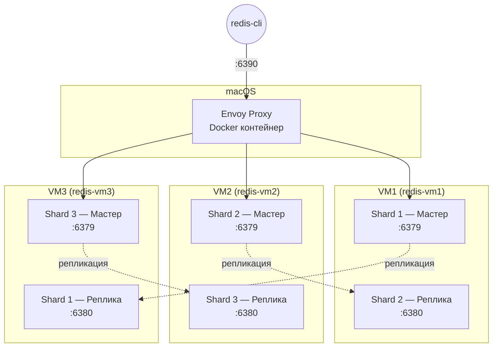

# Redis Cluster на OrbStack VM + Envoy

Домашнее задание: распределённый Redis Cluster на трёх OrbStack VM с проксированием через Envoy.

## Обзор

Три VM, каждая — отдельный сервер. На каждом по два Redis-инстанса (мастер одного шарда + реплика другого). Envoy стоит между клиентом и кластером, прозрачно перенаправляя запросы по слотам.



## Документация

| Документ | Что внутри |
|---|---|
| [REDIS_VM.md](REDIS_VM.md) | Общая часть: зачем, архитектура, как работает Envoy |
| [docs/setup-redis-manual.md](docs/setup-redis-manual.md) | Ручная настройка Redis на VM |
| [docs/setup-envoy-manual.md](docs/setup-envoy-manual.md) | Ручная настройка Envoy |
| [docs/tls.md](docs/tls.md) | Шифрование трафика (TLS) |
| [docs/failover.md](docs/failover.md) | Тест failover |
| [docs/monitoring.md](docs/monitoring.md) | Мониторинг: Prometheus + Grafana |

## Быстрый старт (скрипты)

```bash
# 1. Создать VM и поставить Redis
bash scripts/setup-vm-redis.sh

# 2. Собрать кластер и запустить Envoy
bash scripts/create-cluster-vm.sh

# 3. Проверить
bash scripts/verify-task2-vm.sh
```

## Структура файлов

```
README.md
REDIS_VM.md                         -- общая часть (теория)
TZ.md                               -- задание
docs/
  setup-redis-manual.md             -- ручная настройка Redis
  setup-envoy-manual.md             -- ручная настройка Envoy
  tls.md                            -- TLS
  failover.md                       -- failover
  monitoring.md                     -- мониторинг
scripts/
  setup-vm-redis.sh               -- создаёт VM и ставит Redis
  create-cluster-vm.sh            -- собирает кластер и запускает Envoy
  verify-task2-vm.sh              -- проверяет и чистит за собой
  setup-tls.sh                    -- генерирует сертификаты и настраивает TLS
  test-failover.sh                -- тест failover
src/
  envoy.yaml                        -- конфиг Envoy (без TLS)
  envoy-tls.yaml                    -- конфиг Envoy (с TLS)
  docker-compose.yaml               -- запуск Envoy
  monitoring/
    docker-compose.yaml             -- Prometheus + Grafana
    prometheus.yml
    grafana/
      dashboards/
        envoy-redis.json            -- дашборд Envoy
        redis-cluster.json          -- дашборд Redis
      provisioning/
        datasources/datasources.yaml
        dashboards/dashboards.yaml
```

## Остановка

```bash
cd src && docker compose down
cd src/monitoring && docker compose down

for vm in redis-vm1 redis-vm2 redis-vm3; do
  orb -m $vm sudo killall redis-server
done

orb delete redis-vm1 --yes
orb delete redis-vm2 --yes
orb delete redis-vm3 --yes
```
