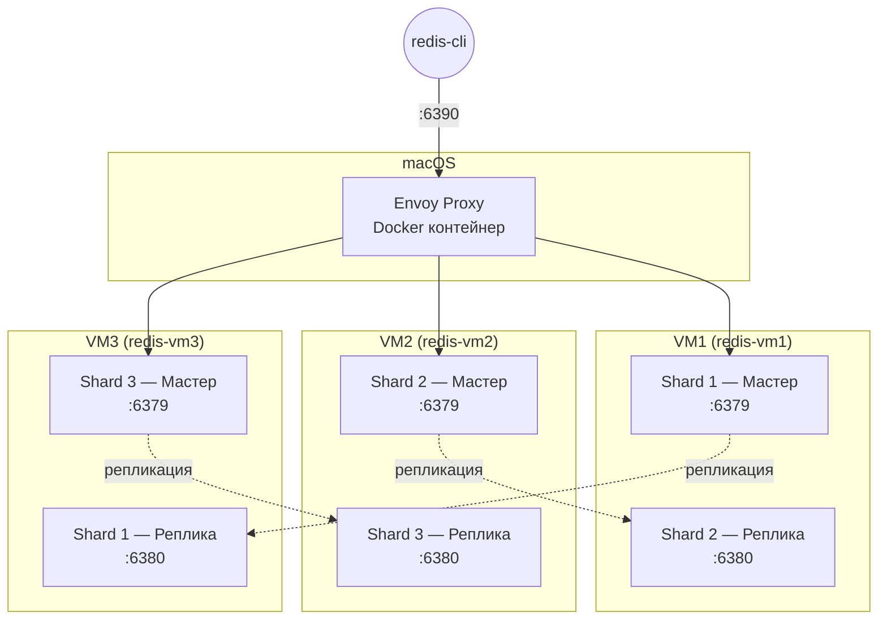

# Redis Cluster на OrbStack VM + Envoy

## Зачем всё это

Допустим, у тебя есть приложение. Любое — магазин, чат, сервис доставки. Оно хранит сессии пользователей в Redis. Пока пользователей мало — один сервер справляется. Но их становится больше, и вот уже Redis не влезает в оперативку, начинает тормозить, а потом и вовсе ложится. Вся система встаёт.

Решение — **Redis Cluster**. Суть простая: данные делятся на 3 части (шарда), и каждая часть живёт на своём сервере. Если один сервер сдохнет, его копия (реплика) подхватит. Пользователь даже не заметит — сессия доступна как ни в чём не бывало.

Осталась одна проблема: **клиент не знает, в каком шарде лежат его данные**. Он может отправить `SET user:123 "active"`, а данные должны оказаться в Shard 2, а не в Shard 1. Кто-то должен этот запрос перенаправить.

Именно тут нужен **Envoy**. Он стоит между клиентом и кластером, знает, где какой слот, и сам перенаправляет запросы. Клиент вообще не догадывается, что за Envoy — три сервера с Redis.

---

## Почему VM, а не Docker-контейнеры

Docker-контейнеры — это процесс в изоляции. У них общий kernel с хостом, свой внутренний IP в Docker-сети, которого снаружи не видно. Для быстрого прототипа — ок.

OrbStack VM — это полноценная Linux-машина. Своё ядро, свой IP, которая видна между VM и с macOS. Это ближе к тому, как устроены реальные сервера в продакшене.

| | Docker-контейнер | OrbStack VM |
|---|---|---|
| Что это | Процесс в изоляции | Полноценная Linux-машина |
| IP-адрес | Внутренний, не виден снаружи | Настоящий IP на bridge-сети |
| Запуск | Мгновенно | ~2 секунды |

Задание предполагает **3 отдельных сервера**. Docker-контейнеры на macOS — упрощение. VM показывают реальную картину.

---

## Почему Envoy, а не HAProxy

**HAProxy** — хороший балансировщик, но он работает на TCP-уровне. Он не понимает протокол Redis Cluster. Когда клиент отправляет `SET key value`, а Redis отвечает `MOVED 9410 192.168.139.59:6379` — «эти данные на другом сервере, иди туда» — HAProxy просто пробрасывает этот ответ клиенту. Клиент должен сам разбираться.

**Envoy** работает умнее. Он понимает протокол Redis Cluster:

- Знает, какие слоты на каких серверах
- Когда Redis отвечает `MOVED`, Envoy сам перенаправляет запрос
- Клиент получает `OK` и не видит никакой магии

| | HAProxy | Envoy |
|---|---|---|
| Понимает Redis Cluster | Нет | **Да** |
| Обрабатывает MOVED/ASK | Нет | **Да** |
| Автоматический failover | Нет | **Да** |
| Клиент должен знать про кластер | Да | **Нет** |

---

## Архитектура



### Как это работает

Ты пишешь `SET user:123 "active"` и отправляешь на `localhost:6390` — туда слушает Envoy.

Envoy берёт ключ `user:123`, считает его хеш, определяет нужный слот, смотрит в свою таблицу и видит: «этот слот на VM2:6379». Отправляет запрос туда. VM2 сохраняет данные, отвечает `OK`. Envoy пробрасывает `OK` обратно.

Клиент получил `OK` и понятия не имеет, что данные оказались на VM2. Вся магия — за кулисами.

### Зачем реплики на разных VM

Каждый мастер копирует данные на реплику **на другой VM**. Shard 1 живёт на VM1, а его реплика — на VM3. Shard 2 живёт на VM2, а его реплика — на VM1.

Это не случайность. Если бы реплика Shard 2 была на той же VM2, то при падении VM2 потерялись бы и мастер, и реплика. Разнос по разным VM гарантирует, что одна сдохшая машина не уничтожит все данные.

---

## Как Envoy узнаёт структуру кластера

Redis Cluster делит ключи на **слоты** — от 0 до 16383. Каждый ключ хешируется, и по модулю 16384 определяется его слот. Каждый шард отвечает за свой кусок:

| Шард | Слоты | Мастер |
|---|---|---|
| Shard 1 | 0–5460 | VM1:6379 |
| Shard 2 | 5461–10922 | VM2:6379 |
| Shard 3 | 10923–16383 | VM3:6379 |

При старте Envoy:

1. Подключается к любой из трёх seed-нод (мастеров)
2. Отправляет `CLUSTER SLOTS` — «расскажи, какие слоты где лежат»
3. Строит внутреннюю таблицу: «слот 42 → VM1, слот 7000 → VM2, ...»
4. При каждом запросе клиента смотрит в таблицу и отправляет на нужный сервер
5. Раз в 30 секунд опрашивает кластер заново — вдруг что-то изменилось

---

## Конфигурация

### Envoy (`src_2_vm/envoy.yaml`)

```yaml
# Админ-интерфейс: curl localhost:9901/stats
admin:
  address:
    socket_address:
      address: 0.0.0.0
      port_value: 9901

static_resources:
  listeners:
  - name: redis_listener
    address:
      socket_address:
        address: 0.0.0.0
        port_value: 6390         # сюда подключается клиент
    filter_chains:
    - filters:
      - name: envoy.filters.network.redis_proxy
        typed_config:
          "@type": type.googleapis.com/envoy.extensions.filters.network.redis_proxy.v3.RedisProxy
          stat_prefix: redis_proxy
          settings:
            op_timeout: 5s
            enable_redirection: true   # Envoy сам обрабатывает MOVED/ASK
          prefix_routes:
            catch_all_route:
              cluster: redis_cluster

  clusters:
  - name: redis_cluster
    connect_timeout: 3s
    cluster_type:
      name: envoy.clusters.redis      # вот это ключевое — Redis Cluster mode
      typed_config:
        "@type": type.googleapis.com/envoy.extensions.clusters.redis.v3.RedisClusterConfig
        cluster_refresh_rate: 30s     # как часто опрашивать CLUSTER SLOTS
    load_assignment:
      cluster_name: redis_cluster
      endpoints:
      - lb_endpoints:
        - endpoint:
            address:
              socket_address:
                address: <VM1-IP>     # seed-ноды
                port_value: 6379
        - endpoint:
            address:
              socket_address:
                address: <VM2-IP>
                port_value: 6379
        - endpoint:
            address:
              socket_address:
                address: <VM3-IP>
                port_value: 6379
```

На что обратить внимание:

- `cluster_type: envoy.clusters.redis` — без этого Envoy думает, что это обычный TCP-бэкенд
- `enable_redirection: true` — иначе `MOVED` уходит клиенту, а Envoy должен обрабатывать сам
- Seed-ноды — входные точки. Envoy подключается к ним и через `CLUSTER SLOTS` узнаёт обо всём кластере

### Redis на каждой VM

Каждая VM запускает **два** процесса Redis:

| VM | Порт | Роль |
|---|---|---|
| redis-vm1 | 6379 | Мастер Shard 1 |
| redis-vm1 | 6380 | Реплика Shard 2 |
| redis-vm2 | 6379 | Мастер Shard 2 |
| redis-vm2 | 6380 | Реплика Shard 3 |
| redis-vm3 | 6379 | Мастер Shard 3 |
| redis-vm3 | 6380 | Реплика Shard 1 |

Конфиг каждого инстанса — минимум:

```
protected-mode no    -- разрешаем внешние подключения
bind 0.0.0.0         -- слушаем на всех интерфейсах
port 6379            -- порт
cluster-enabled yes  -- режим кластера
```

---

## Пошаговая инструкция

### Шаг 1: Создать VM и поставить Redis

```bash
bash scripts/redis_vm/setup-vm-redis.sh
```

Что делает:
1. Создаёт 3 Ubuntu VM через OrbStack
2. Ставит Redis на каждой
3. Создаёт по два конфига на каждой VM (мастер + реплика)
4. Запускает Redis
5. Проверяет, что все 6 нод отвечают на PING

### Шаг 2: Собрать кластер и запустить Envoy

```bash
bash scripts/redis_vm/create-cluster-vm.sh
```

Что делает:
1. Узнаёт IP каждой VM
2. Создаёт кластер — говорит каждой ноде: «вот твои соседи, общайтесь»
3. Каждая нода получает свой диапазон слотов
4. Реплики привязываются к мастерам
5. Запускает Envoy через Docker

### Шаг 3: Проверить

```bash
bash scripts/redis_vm/verify-task2-vm.sh
```

Или руками:

```bash
# Записываем — клиент не знает про кластер
redis-cli -p 6390 SET session:user123 "active"

# Читаем
redis-cli -p 6390 GET session:user123
# → "active"

# Смотрим метрики Envoy
curl -s 'http://localhost:9901/stats?usedonly' | grep redis
```

Что происходит при `SET session:user123 "active"`:
1. Клиент отправляет на `localhost:6390` (Envoy)
2. Envoy считает хеш ключа, определяет слот
3. Смотрит в таблицу: «этот слот на VM2:6379»
4. Перенаправляет запрос
5. VM2 сохраняет, отвечает `OK`
6. Envoy пробрасывает `OK` клиенту
7. Клиент видит `OK` и не знает, что данные на VM2

---

## Метрики

Envoy отдаёт метрики на `localhost:9901/stats`:

```bash
curl -s 'http://localhost:9901/stats?usedonly' | grep redis
```

Что смотреть:

- `redis.redis_proxy.command.set.success` — сколько успешных SET
- `redis.redis_proxy.command.get.success` — сколько успешных GET
- `cluster.redis_cluster.membership_total` — сколько нод нашёл Envoy (должно быть 6)
- `cluster.redis_cluster.upstream_internal_redirect_succeeded_total` — сколько раз Envoy сам обработал MOVED (хороший знак)

---

## Остановка

```bash
# Envoy
cd src_2_vm && docker compose down

# Redis на всех VM
for vm in redis-vm1 redis-vm2 redis-vm3; do
  orb -m $vm sudo killall redis-server
done

# Удалить VM
orb delete redis-vm1 --yes
orb delete redis-vm2 --yes
orb delete redis-vm3 --yes
```

---

## Файлы

```
REDIS_VM.md
src_2_vm/
  envoy.yaml            -- конфиг Envoy
  docker-compose.yaml   -- запуск Envoy
scripts/redis_vm/
  setup-vm-redis.sh     -- создаёт VM и ставит Redis
  create-cluster-vm.sh  -- собирает кластер и запускает Envoy
  verify-task2-vm.sh    -- проверяет и чистит за собой
```
