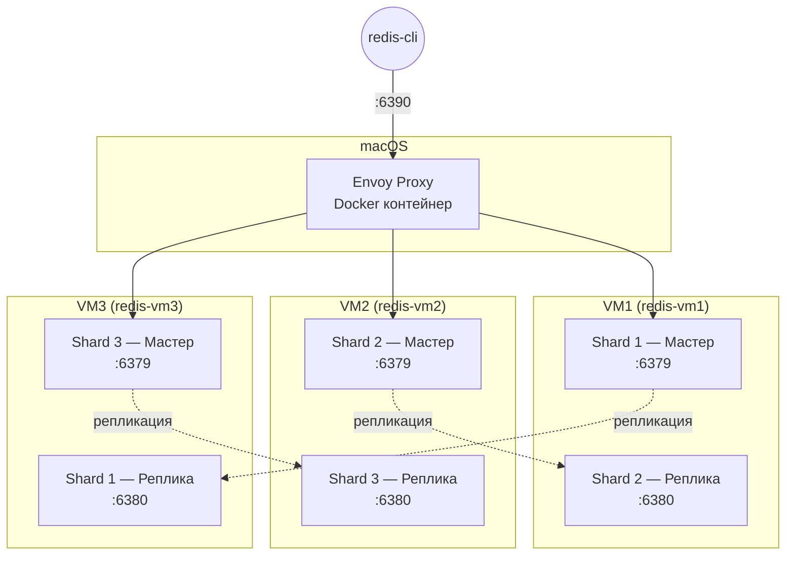

# Redis Cluster на OrbStack VM + Envoy

## Зачем всё это

Допустим, у тебя есть приложение. Любое — магазин, чат, сервис доставки. Оно хранит сессии пользователей в Redis. Пока пользователей мало — один сервер справляется. Но их становится больше, и вот уже Redis не влезает в оперативку, начинает тормозить, а потом и вовсе ложится. Вся система встаёт.

Решение — **Redis Cluster**. Суть простая: данные делятся на 3 части (шарда), и каждая часть живёт на своём сервере. Если один сервер сдохнет, его копия (реплика) подхватит. Пользователь даже не заметит — сессия доступна как ни в чём не бывало.

Осталась одна проблема: **клиент не знает, в каком шарде лежат его данные**. Он может отправить `SET user:123 "active"`, а данные должны оказаться в Shard 2, а не в Shard 1. Кто-то должен этот запрос перенаправить.

Именно тут нужен **Envoy**. Он стоит между клиентом и кластером, знает, где какой слот, и сам перенаправляет запросы. Клиент вообще не догадывается, что за Envoy — три сервера с Redis.

---

## Почему Envoy, а не HAProxy

**HAProxy** — хороший балансировщик, но он работает на TCP-уровне. Он не понимает протокол Redis Cluster. Когда клиент отправляет `SET key value`, а Redis отвечает `MOVED 9410 192.168.139.59:6379` — «эти данные на другом сервере, иди туда» — HAProxy просто пробрасывает этот ответ клиенту. Клиент должен сам разбираться.

**Envoy** работает умнее. Он понимает протокол Redis Cluster:

- Знает, какие слоты на каких серверах
- Когда Redis отвечает `MOVED`, Envoy сам перенаправляет запрос
- Клиент получает `OK` и не видит никакой магии

| | HAProxy | Envoy |
|---|---|---|
| Понимает Redis Cluster | Нет | **Да** |
| Обрабатывает MOVED/ASK | Нет | **Да** |
| Автоматический failover | Нет | **Да** |
| Клиент должен знать про кластер | Да | **Нет** |

---

## Архитектура



### Как это работает

Ты пишешь `SET user:123 "active"` и отправляешь на `localhost:6390` — туда слушает Envoy.

Envoy берёт ключ `user:123`, считает его хеш, определяет нужный слот, смотрит в свою таблицу и видит: «этот слот на VM2:6379». Отправляет запрос туда. VM2 сохраняет данные, отвечает `OK`. Envoy пробрасывает `OK` обратно.

Клиент получил `OK` и понятия не имеет, что данные оказались на VM2. Вся магия — за кулисами.

### Зачем реплики на разных VM

Каждый мастер копирует данные на реплику **на другой VM**. Shard 1 живёт на VM1, а его реплика — на VM3. Shard 2 живёт на VM2, а его реплика — на VM1.

Это не случайность. Если бы реплика Shard 2 была на той же VM2, то при падении VM2 потерялись бы и мастер, и реплика. Разнос по разным VM гарантирует, что одна сдохшая машина не уничтожит все данные.

---

## Как Envoy узнаёт структуру кластера

Redis Cluster делит ключи на **слоты** — от 0 до 16383. Каждый ключ хешируется, и по модулю 16384 определяется его слот. Каждый шард отвечает за свой кусок:

| Шард | Слоты | Мастер |
|---|---|---|
| Shard 1 | 0–5460 | VM1:6379 |
| Shard 2 | 5461–10922 | VM2:6379 |
| Shard 3 | 10923–16383 | VM3:6379 |

При старте Envoy:

1. Подключается к любой из трёх seed-нод (мастеров)
2. Отправляет `CLUSTER SLOTS` — «расскажи, какие слоты где лежат»
3. Строит внутреннюю таблицу: «слот 42 → VM1, слот 7000 → VM2, ...»
4. При каждом запросе клиента смотрит в таблицу и отправляет на нужный сервер
5. Раз в 30 секунд опрашивает кластер заново — вдруг что-то изменилось

---

## Что такое MOVED/ASK

Когда клиент отправляет запрос не на ту ноду, Redis отвечает:

```
MOVED 9410 192.168.139.59:6379
```

Это значит: «данные для этого ключа на слоте 9410, иди на 192.168.139.59:6379».

**Без Envoy** клиент должен сам переподключиться и повторить запрос. Флаг `-c` в `redis-cli` делает это автоматически, но обычное приложение — нет.

**С Envoy** прозрачно: Envoy видит `MOVED`, перенаправляет запрос на правильную ноду и возвращает клиенту `OK`. Клиент ничего не знает про слоты и шарды.

---

## Распределение ролей по VM

| VM | Порт | Роль |
|---|---|---|
| redis-vm1 | 6379 | Мастер Shard 1 |
| redis-vm1 | 6380 | Реплика Shard 2 |
| redis-vm2 | 6379 | Мастер Shard 2 |
| redis-vm2 | 6380 | Реплика Shard 3 |
| redis-vm3 | 6379 | Мастер Shard 3 |
| redis-vm3 | 6380 | Реплика Shard 1 |

Каждая VM хранит данные двух шардов. Если одна VM упадёт — ни один шард не потеряет все данные, потому что реплика живёт на другой VM.

---

## Метрики

Envoy отдаёт метрики на `localhost:9901/stats`:

```bash
curl -s 'http://localhost:9901/stats?usedonly' | grep redis
```

Ключевые метрики:

| Метрика | Что показывает |
|---|---|
| `redis.redis_proxy.command.set.success` | Успешные SET |
| `redis.redis_proxy.command.get.success` | Успешные GET |
| `cluster.redis_cluster.membership_total` | Сколько нод нашёл Envoy (должно быть 6) |
| `cluster.redis_cluster.upstream_internal_redirect_succeeded_total` | Сколько раз Envoy обработал MOVED |
